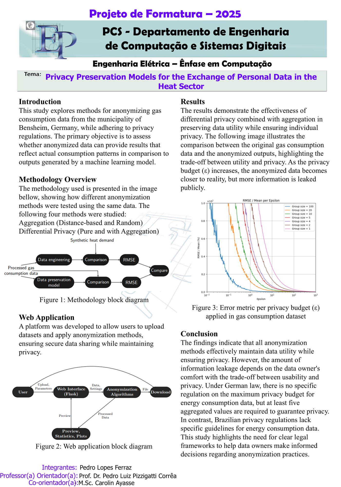
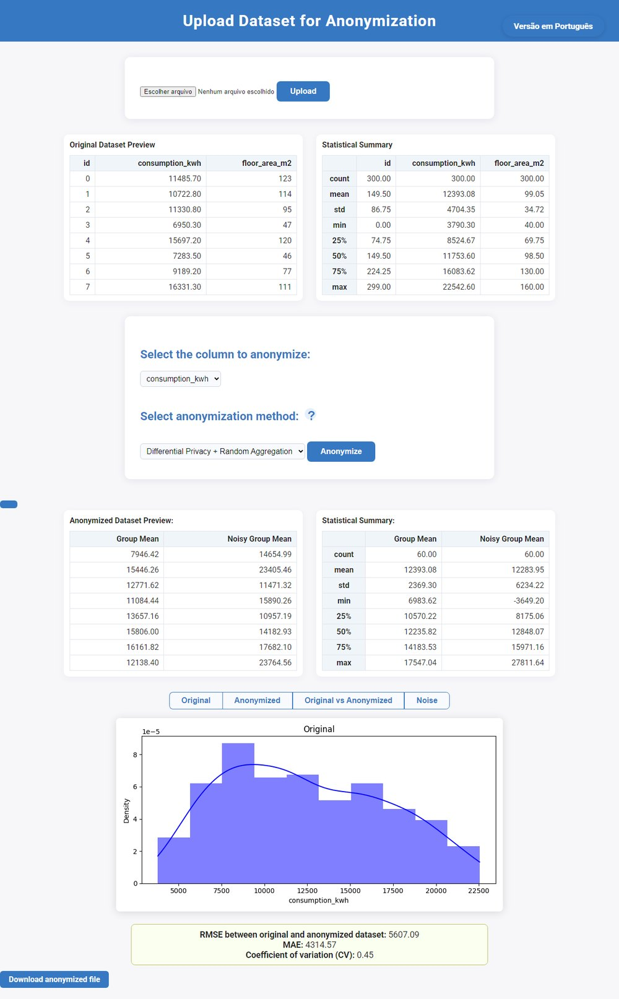

<p align="center">
  
</p>

<h1 align="center">Differential Privacy for energy data</h1>

<p align="center">
  Privacy preservation models for the exchange of personal data in the heat sector.<br>
  M.Sc. thesis at <b>TU Darmstadt</b>, also presented as my final-year project (TCC) at <b>Poli-USP</b>, 2025.
</p>

> **This repository is an archive.** It holds the code as it stood when the work was submitted.
> The notebooks need the original gas-consumption data, which belongs to its provider and is not
> published here, and the hosted demo is no longer online. The web app still runs locally — see
> [below](#run-the-web-app).

<p align="center">
  
</p>

## The question

Household gas-consumption data would help a town plan its heat supply, but it is personal data.
Using the 2020 gas consumption of 114 buildings in Bensheim, Germany, the thesis asks whether an
anonymized version of that data can still answer the questions the raw data answers, and how it
compares with the synthetic heat demand a machine-learning model produces for the same buildings.

Four anonymization methods were applied to the same data and compared by their error against the
real values:

- **Random aggregation**: records are grouped at random and only each group's mean is released.
- **Distance-based aggregation**: records within a given distance of each other form a group.
- **Differential privacy**: Laplace noise calibrated to a privacy budget ε.
- **Differential privacy with aggregation**: the noise is added to group means instead of to single records.

## What it found

- Every method kept the data useful while protecting individual buildings. How much is leaked is
  a choice the data owner makes on the trade-off between usefulness and privacy.
- The error falls as ε grows, and the larger the groups, the smaller the ε needed for the same error:
  aggregating first reaches the same accuracy with a much smaller ε.
- German rules set no maximum ε for energy data but require at least five aggregated values;
  Brazilian regulation has no specific guidance for energy data at all.

## Run the web app

The deliverable for Poli-USP is a Flask app that applies these methods to any tabular dataset. Upload
a CSV or Excel file, choose a numeric column and a method, tune ε or the group size, and compare the
original and anonymized data side by side, with summary statistics and plots, then download the
result. It is in Portuguese and English, and it keeps a running total of the ε spent in the session.
Distance aggregation needs latitude and longitude columns.

<p align="center">
  
</p>

```bash
cd website
python -m venv venv
source venv/bin/activate          # Windows: venv\Scripts\activate
pip install -r requirements_website.txt
python website.py                 # http://127.0.0.1:5000
```

`website/sample_data/households_synthetic.csv` is a made-up dataset (300 households with
coordinates, floor area and consumption) to try it with. There is also a `Dockerfile` in
`website/`, which serves the app with gunicorn on port 5000.

## What's here

| Path | What it holds |
|---|---|
| `notebooks/processing.ipynb` | Cleaning the raw consumption data and matching it to the synthetic heat-demand grid |
| `notebooks/data_comparison*.ipynb` | Real consumption against the model's heat demand, per building and aggregated |
| `notebooks/dp_initial.ipynb`, `dp_opendp.ipynb`, `real_data_dp.ipynb` | The differential-privacy experiments, first by hand and then with [OpenDP](https://opendp.org/) |
| `functions/` | Helpers the notebooks import |
| `website/` | The Flask app, its template and its Dockerfile |

The notebooks are published without their outputs and without `data/`, so they document the method
but do not run as they are.

## Acknowledgements

Supervised by Prof. Dr. Pedro Luiz Pizzigatti Corrêa, co-supervised by M.Sc. Carolin Ayasse.
The heat-demand model is by the Landes Energie Agentur Hessen. Built on [OpenDP](https://opendp.org/),
[Flask](https://flask.palletsprojects.com/), pandas, seaborn and matplotlib.
